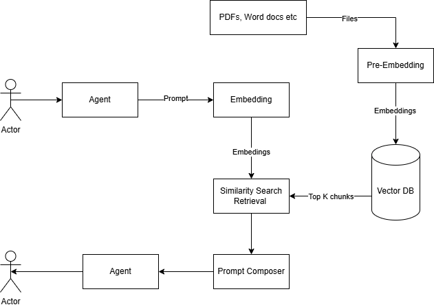

# RAGAgent

A small Retrieval-Augmented Generation (RAG) example agent that demonstrates using a local Chroma vector store and a simple agent runner.



Features

- Simple RAG demo using a local SQLite-backed Chroma database.
- Minimal agent entrypoint in `agent.py`.
- Vector storage helpers in `vectorDB/vectorStorage.py`.
- Basic logging in `logger/agentLogger.py`.

## Quick Start (Windows)

1. Create and activate a virtual environment:

```powershell
python -m venv .venv
.\.venv\Scripts\Activate.ps1
```

2. Install dependencies (if a `requirements.txt` exists):

```powershell
pip install -r requirements.txt
```

3. Run the agent:

```powershell
python agent.py
```

## Repository Layout

- `agent.py` — main agent entrypoint
- `database/` — Chroma SQLite files and persisted vector data
- `vectorDB/vectorStorage.py` — vector DB helpers
- `logger/agentLogger.py` — logging utilities
- `docs/` — documentation (if any)

Notes

- The project expects a local vector DB file at `database/chroma.sqlite3`.
- Adjust paths and environment variables as needed for your setup.

Contributing

- Contributions and issues are welcome — open a PR or an issue.
